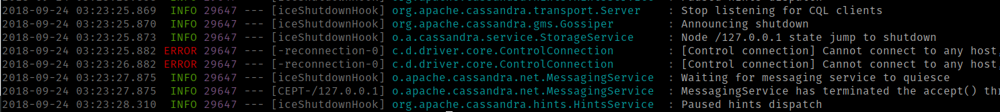

# Logging Lib

Convenience lib for logging. 
Contains dependencies to SLF4J and Logback classic.

Configured with RollingFileAppender and  ConsoleAppender.

ConsoleAppender has Ansi Colors inspired by Spring boot.
```  
  <dependency>
    <groupId>de.mc</groupId>
    <artifactId>logging</artifactId>
    <version>1.1.0</version>
  </dependency>
    
```


### License
Copyright (C) 2018 Mind Consulting

Free as beer.

<a href="http://mind-consulting.de/"></a>

